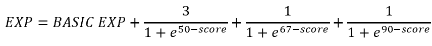

# CPEN321-Quizzical

## Overview
 CPEN321 APP  
Name of Project: Project Quizzical  

Team members of our Project: Jason Bai, Andrew Lance Chan, Ihsan Olawale, Yuntao Wu  

## Current progress  

The progress is written in the sequence of implementation.  

### Front-end  
1. Login  
1.1 Google Authentication implemented  
1.2 Prompt user for username, email  
(default set to google username, email)  
1.3 Checkbox for instructor/teacher  
1.4 Validate username, email and upload to the server  
1.5 Firebase push notification skeleton implemented  
2. Homepage  
2.1 Basics UI setup, used tabbed layour for switching among quiz, leader board/class statistics and user profile.  
2.2 Profile page image, username, email (change functions included) done  
2.3 Currently leader board/class statistic page shows time and class code(+ course category)   
2.4 Prompt user to setup/join class on first sign in  
2.5 Multiple classes supported, user can switch between different classes  
2.6 In the profile fragment, user can see how many classes he/she is enrolled in, how many quizzes he/she has created/done, how many EXP he/she has earned.  
2.7 teacher class statistic board set up finished.  
2.8 teacher leader board and statistic switching finished.  
2.9 basic quiz/leaderboard refreshing done.(student side not tested yet)    
2.10 quiz fragment UI finished  
2.11 leader board/class statistic fragment UI finished  
3. Quiz  
3.1 A Quiz will load a set of questions (currently only multiple choices are supported)  
3.2 Choices can be either plain text, latex, html formatted, or image  
3.3 Once a user click on the choice, it will change the color of the choice to highlight the selected choice.  
3.4 After the user submits a question, they will be informed if they are correct or not. If they are incorrect, correct answer will also be highlighted.  
3.5 After the user finishes a quiz, they will be shown how they did in the quiz.  
3.6 The quiz result (including score and wrong question numbers) will be uploaded to the server.  
3.7 UI and logic set up for teacher creating quiz finished    
4. Complex logic  
4.1 A user is ranked by his/her overall EXP in a semester  
4.2 The EXP for the student is calculated as follows:  
after each quiz is finished  
  
5. Other things  
5.1 Most parts are translated in Chinese as well.  
5.2 Some code refactored after checking with Codacy.  
5.3 Customized buttons to be round cornered

### Back-end  
1. Simple POST GET request handling done.  
2. user info (username, email, profile image, is_instructor, class taken, class statistics) mostly done  

## TODO list
1. UI set up for home activity  
**Note:** need to get info from the server for these layouts, such as quizzes available, class average scores, user ranking.  
1.3 maybe we can add some review quizzes for all the wrong questions a student has got, the wrong question ids will be sent to the server  
3. Front-Back end communication  
3.2 class info (class statistics)  
3.3 quiz info (created quiz parsed and sent onto the server; retrive quiz from the server)  
4. Push notification  
4.1 email when account created  
4.2 email when class created  
4.3 mobile notification when quiz, leaderboard updated  
5. Complex logic  
5.1 The EXP for the teacher is calculated as follows:  
After each quiz is created  
EXP = BASIC_EXP, (BASIC_EXP = 10)  

When a student/another teacher liked the quiz, EXP += BONUS_EXP, BONUS_EXP = ?  
